<p align="center">
  <a href="https://robbyczesany.com"></a>
</p>

<p align="center">
  <a href="https://robbyczesany.com"></a>
  <a href="https://websearchplus.xyz"></a>
  <a href="https://activityplus.xyz"></a>
  <a href="https://openagentfleet.xyz"></a>
  <a href="mailto:robby@robbyczesany.com"></a>
</p>

| **416★** | **19** | **88k+** | **12** |
| :-- | :-- | :-- | :-- |
| web-search-plus for Hermes | merged PRs in OpenClaw core | ClawHub skill downloads | published skills |

I build search, memory and runtime tools for AI agents, and each one leaves a record: which source it used, which provider failed, which commit broke the build. The same code runs in [OpenClaw](https://github.com/openclaw/openclaw), [Hermes](https://github.com/NousResearch/hermes-agent), [NanoClaw](https://github.com/nanocoai/nanoclaw), [Grok Build](https://github.com/xai-org/plugin-marketplace) and any MCP client.

## Work

### 🔎 [Web Search Plus](https://websearchplus.xyz) · flagship

Search for agents that returns the original links and the cleaned page, never a generated answer. It picks a provider per query, falls back when one fails, and attaches a routing receipt to every result. 15 search and 9 extract providers; one key is enough.

```bash
hermes plugins install web-search-plus --enable          # Hermes, official plugin catalog
uvx --from web-search-plus-mcp==4.3.1 web-search-plus-mcp # any MCP client
grok plugin install robbyczgw-cla/web-search-plus-mcp     # Grok Build
```

[hermes-web-search-plus](https://github.com/robbyczgw-cla/hermes-web-search-plus) · [web-search-plus-mcp](https://github.com/robbyczgw-cla/web-search-plus-mcp) ([PyPI](https://pypi.org/project/web-search-plus-mcp/), 1.2k downloads last month) · [OpenClaw plugin](https://github.com/robbyczgw-cla/web-search-plus-plugin) · [NanoClaw](https://github.com/robbyczgw-cla/nanoclaw-web-search-plus)

### 📊 [Activity+](https://activityplus.xyz) · macOS

A system monitor that names the app behind the load. It folds about 900 processes into the 80 or so apps you recognize, keeps 30 days of history, answers "why is my Mac slow?" with a finding and a fix button, and lists dev servers per project with their ports. Agents get the same data through a read-only MCP server (`aplus mcp`). Swift, MIT, notarized, Apple silicon, macOS 15+. No account, no analytics.

→ [activityplus.xyz](https://activityplus.xyz) · [activity-plus](https://github.com/robbyczgw-cla/activity-plus) · [1-minute film](https://activityplus.xyz/assets/video/activityplus-trailer.mp4)

### 🖥️ [OpenAgentFleet](https://github.com/robbyczgw-cla/openagentfleet) · runtime

A macOS app for agents that run on a separate Linux machine. You watch every step on that machine, approve the sensitive ones, and take the keyboard when a human has to. Grok Build, Codex and OpenCode in one workspace. Go controller, Tauri shell, Apache-2.0, signed alpha for Apple Silicon. → [openagentfleet.xyz](https://openagentfleet.xyz)

### ✂️ The reduction toolkit

Three CLIs that shrink a failure until it fits in a message.

- **[crashmin](https://github.com/robbyczgw-cla/crashmin)** turns a grotesque curl into the shortest request that still fails
- **[repromin](https://github.com/robbyczgw-cla/repromin)** cuts a Playwright spec to the fewest actions that still fail
- **[commit-delta](https://github.com/robbyczgw-cla/commit-delta)** finds the smallest set of changes in a dirty tree that breaks the build

### 🌙 Memory and autonomy

Skills that watch, remember and propose. Nothing lands until you approve it.

| Skill | What it does |
| :-- | :-- |
| [lucid-dreamer](https://clawhub.ai/robbyczgw-cla/lucid-dreamer) | Reviews agent memory every night, finds patterns, proposes changes |
| [skillminer](https://clawhub.ai/robbyczgw-cla/skillminer) | Finds work that keeps repeating and drafts a skill for it; never activates itself |
| [topic-monitor](https://clawhub.ai/robbyczgw-cla/topic-monitor) | Watches topics on a schedule and scores each item; in [DigitalOcean's OpenClaw skills guide](https://www.digitalocean.com/resources/articles/what-are-openclaw-skills) |
| [roundtable](https://clawhub.ai/robbyczgw-cla/roundtable) | Runs three agents in parallel and makes them cross-examine each other |

Also: [agent-chronicle](https://clawhub.ai/robbyczgw-cla/agent-chronicle), [pip-the-mug](https://github.com/robbyczgw-cla/pip-the-mug) (a WebMCP playground where your browser agent is HR), [OpenCami](https://github.com/robbyczgw-cla/opencami) (web client for OpenClaw).

## Upstream

- **OpenClaw:** 19 merged PRs in core: Telegram, Discord, sessions, formatting, OpenRouter thinking
- **Nous Research:** web-search-plus in the [Hermes plugin catalog](https://hermes-agent.nousresearch.com/docs/plugins); co-author of the [prompt-cache fix](https://github.com/NousResearch/hermes-plugin-claude-subscription-directsdk/commit/d032bed) in the Claude subscription plugin
- **Lists:** [awesome-openclaw-skills](https://github.com/VoltAgent/awesome-openclaw-skills), [awesome-hermes-agent](https://github.com/0xNyk/awesome-hermes-agent)

## How I build

`design` the system → `agent` writes the code and does the research → `review` the diff before it merges → `test` behavior, fallbacks, receipts → `ship` what survived.

**Stack:** Go · Python · TypeScript · React / React Native · Tauri · Node · Vite · Expo · SQLite · Docker / Colima · MCP

<sub>Graz, Austria (CET) · open to agent-infrastructure work: robby@robbyczesany.com</sub>
